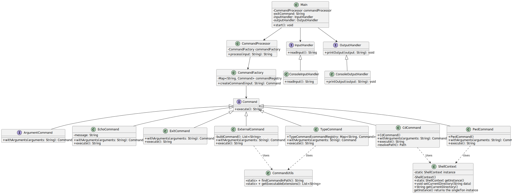

# Nimbus Shell

Nimbus Shell is a lightweight command-line shell that supports basic features like `echo`, directory navigation, quoting, redirection, and autocompletion.

## Features

- **Echo**: Outputs text to the terminal.
- **Navigation**: Change directories and view current directory.
- **Quoting**: Manage strings with single and double quotes.
- **Redirection**: Redirect output to files and other processes.
- **Autocompletion**: Basic autocompletion for commands and paths.
- **Many more to come**.

## UML Diagram

Here’s a basic UML diagram of the shell architecture:



## Installation

1. Clone the repository:
    ```bash
    git clone https://github.com/yourusername/nimbus-shell.git
    ```

2. Build the project:
    ```bash
    cd nimbus-shell
    make
    ```

3. Run the shell:
    ```bash
    ./nimbus-shell
    ```

## License

This is a personal project. Feel free to explore the code, but it's not intended for regular use.
